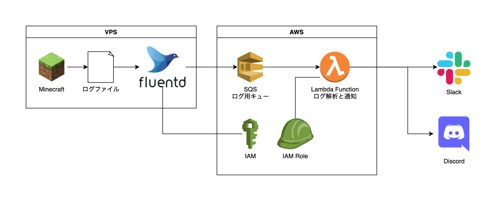

# Minecraftサーバの管理ツール

## 実装した機能

* Minecraftサーバに誰かがログインしたらSlackに通知する

## 構成



## インストール

### Slack

* Webhook URLを発行

### Discord

* Webhook URLを発行

### AWS

```
$ cd resources
$ npm install
$ cd ..
$ npm install
$ cdk deploy -c slackWebhookUrl=<YOUR_SLACK_WEBHOOK_URL> -c discordWebhookUrl=<YOUR_DISCORD_WEBHOOK_URL>
```
`slackWebhookUrl`と`discordWebhookUrl`はどちらかだけでもOK．

* 作成された`MinecraftManStack-MinecraftServer`から始まるAMユーザのアクセスキーを発行する．
* 作成された`MinecraftManStack-MinecraftLog`から始まるSQSのURLをコピーしておく．

### Minecraftサーバ

* Fluentdをインストール
    * [Installation - Fluentd](https://docs.fluentd.org/installation)
* Amazon SQS output plugin for Fluentをインストール
    * [ixixi/fluent-plugin-sqs: Store fluent-event as queue message to Amazon SQS.](https://github.com/ixixi/fluent-plugin-sqs#label-Install)
* `/etc/td-agent/td-agent.conf`を次のように編集

```
<source>
  type tail
  format none
  path /opt/minecraft_server/logs/latest.log
  pos_file /opt/minecraft_server/logs/latest.log.pos
  tag log.minecraft
</source>

<match log.minecraft>
  @type sqs
  sqs_url <作成されたSQSのURL>
  aws_key_id <IAMで発行したアクセスキーID>
  aws_sec_key <IAMで発行したシークレットアクセスキー>
  message_group_id minecraft
  <buffer>
    flush_interval 10s
  </buffer>
</match>
```

* td-agentが記録するポジションファイルを作成

```
# touch /opt/minecraft_server/logs/latest.log.pos
# chown td-agent:td-agent /opt/minecraft_server/logs/latest.log.pos
```

* tg-agentサービスを再起動

```
# systemctl restart td-agent
```
